<div align="center">


### Rebuild Groot Constantia Manor Through Interactive Architectural Learning

**PP410 Creative Practice – Theme 2 Phase 3 Final Deliverable**

**Iné Smith**  
**Student Number: 221076**  
**Postgraduate Diploma (PGD)**  
**Open Window Institute**

<br>

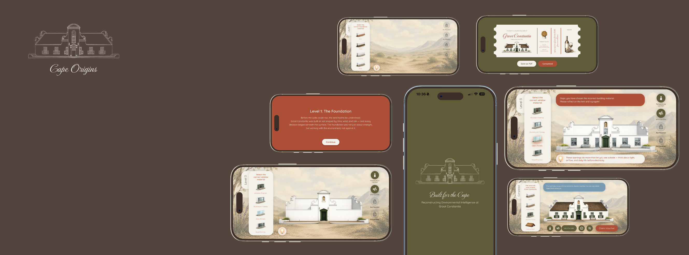

<br>


</div>

---

# Overview

Cape Origins is an interactive educational mobile application that transforms architectural heritage into an immersive learning experience.

Inspired by the historic Groot Constantia Manor, the application allows users to reconstruct the building through a series of interactive challenges while learning how architecture responds to environmental conditions such as climate, temperature, and wind.

Rather than presenting information through traditional text-heavy methods, Cape Origins encourages active participation, allowing users to discover architectural principles through gameplay, experimentation, and visual storytelling.

---

# Project Information

| Item | Details |
|--------|--------|
| **Project Name** | Cape Origins |
| **Student Name** | Iné Smith |
| **Student Number** | 221076 |
| **Module** | PP410 Creative Practice |
| **Theme** | Theme 2 |
| **Phase** | Phase 3 |
| **Submission** | Final Deliverable |
| **Qualification** | Postgraduate Diploma (PGD) |
| **Institution** | Open Window Institute |

---

# Project Aim

The aim of Cape Origins is to:

- Promote awareness of South African architectural heritage.
- Encourage learning through interaction and exploration.
- Demonstrate the relationship between architecture and climate.
- Transform historical content into an engaging digital experience.
- Create meaningful educational experiences through interaction design.

---

# Features

## Interactive Building Journey

Users progress through multiple construction stages:

- Foundation Selection
- Wall Construction
- Window Placement
- Roof Design
- Manor Completion

Each stage requires users to select the most suitable architectural solution before progressing.

---

## Climate Learning System

Throughout the experience users unlock educational information about:

- Wind Durability
- Temperature Comfort
- Climate Adaptation

These learning moments explain how architecture responded to environmental challenges within the Cape.

---

## Interactive Gameplay

### Educational Challenges

- Multiple-choice building decisions
- Progressive learning system
- Climate-based educational content

### Dynamic Feedback

- Success animations
- Educational overlays
- Progressive content unlocking
- Guided level progression

### Landscape Experience

Cape Origins has been specifically designed for landscape orientation to create a more immersive learning environment.

---

# User Journey

```text
Splash Screen
      ↓
Home Screen
      ↓
Foundation Level
      ↓
Wall Level
      ↓
Window Level
      ↓
Roof Level
      ↓
Completed Manor
      ↓
Reward / Voucher Screen
```

---

# Design System

## Colour Palette

| Colour | Hex |
|---------|---------|
| Olive Green | #605C39 |
| Cream | #F4F1EA |
| Dark Brown | #3F3A25 |
| Success Green | #6F8D55 |

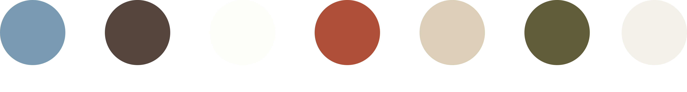

---

## Typography

### Monte Carlo

Used for:

- Branding
- Decorative headings
- Historical atmosphere

### Quicksand

Used for:

- Educational content
- Interface labels
- User interactions
- Body text

---

# Technology Stack

| Technology | Purpose |
|------------|----------|
| React Native | Mobile Application Development |
| Expo | Development Environment |
| TypeScript | Type Safety |
| Expo Blur | Glassmorphism Effects |
| Expo Font | Custom Typography |
| Expo Screen Orientation | Landscape Lock |
| React Navigation | Navigation System |

---

# Installation

## Prerequisites

Before running the project, ensure that the following are installed:

- Node.js
- npm
- Expo CLI
- Xcode (macOS)

---

## Clone Repository

```bash
git clone https://github.com/YOUR_USERNAME/cape-origins.git
```

---

## Navigate to Project

```bash
cd cape-origins
```

---

## Install Dependencies

```bash
npm install
```

---

## Start Expo

```bash
npx expo start
```

---

# Running on iPhone 16 Pro Max Simulator

Cape Origins was designed and tested primarily on the **iPhone 16 Pro Max Simulator**.

## Install Xcode

Download and install Xcode from the App Store.

Open:

```text
Xcode → Settings → Components
```

Download the latest available iOS Simulator Runtime.

---

## Open Simulator

Launch the simulator via:

```text
Xcode → Open Developer Tool → Simulator
```

or simply press:

```text
i
```

inside the Expo terminal.

---

## Run on iPhone 16 Pro Max

```bash
npx expo run:ios --simulator="iPhone 16 Pro Max"
```

---

# Application Mockups

## Home Screen

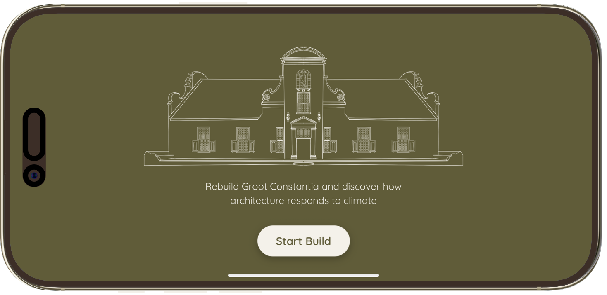

---

## Foundation Level

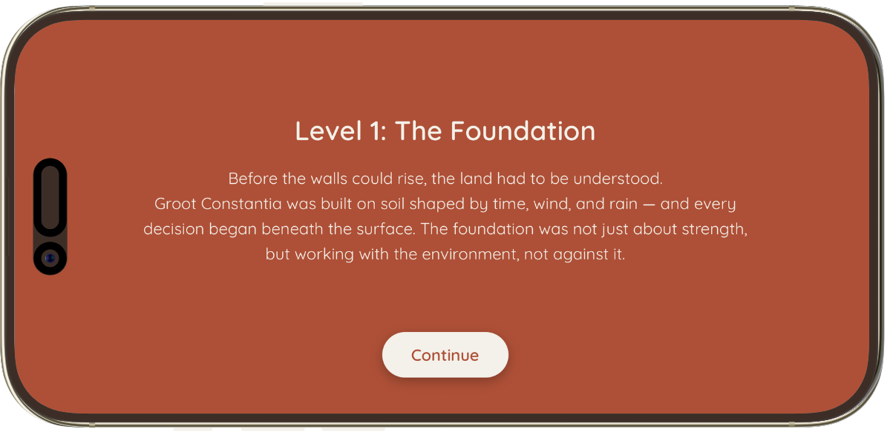
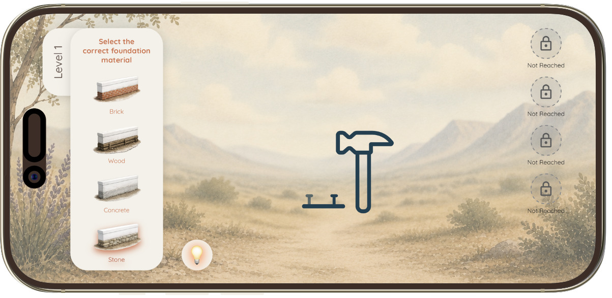
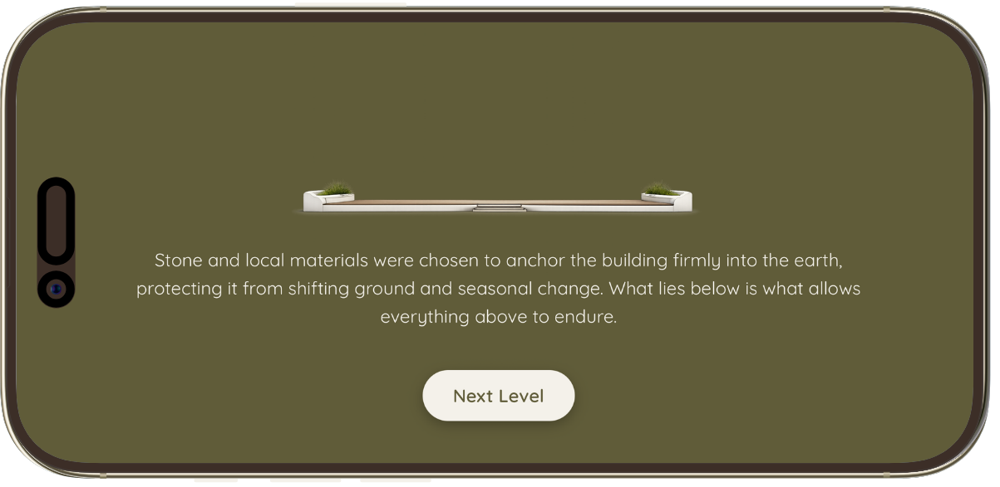


---

## Wall Level

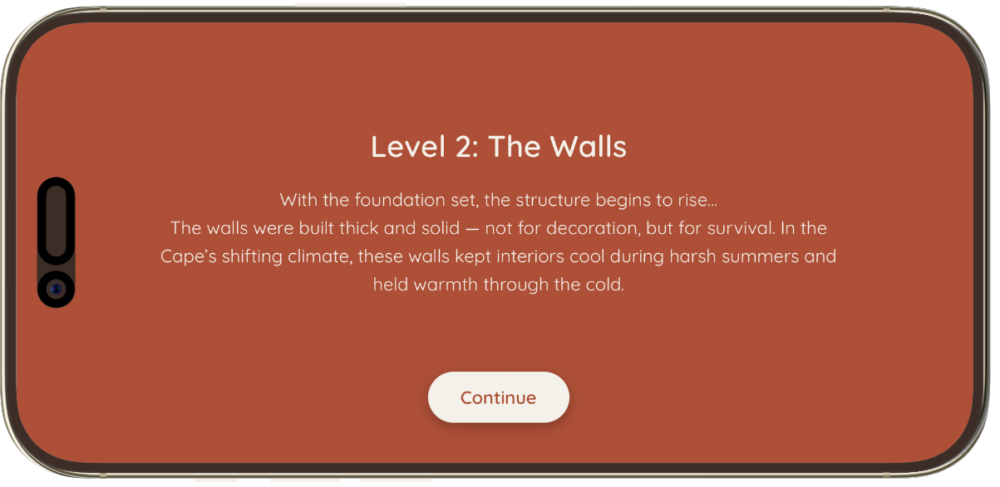
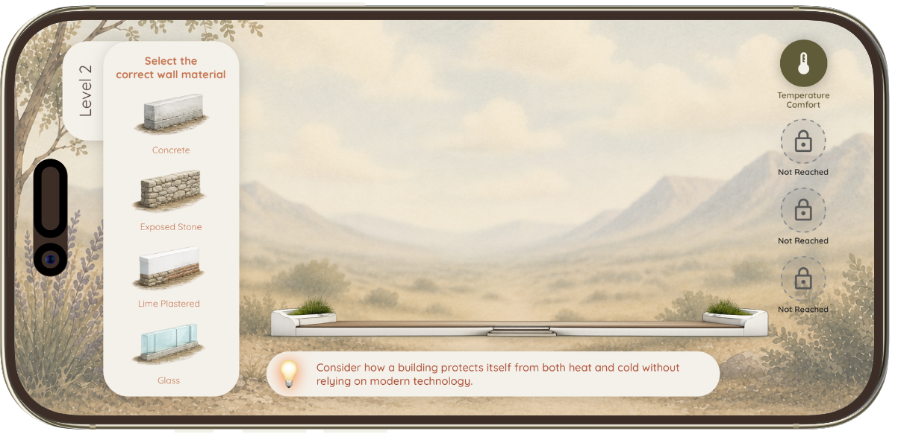
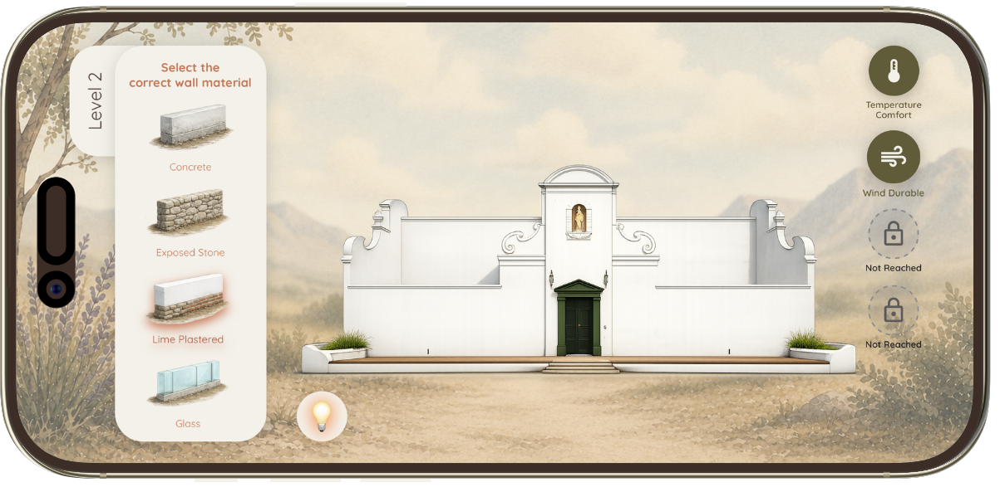
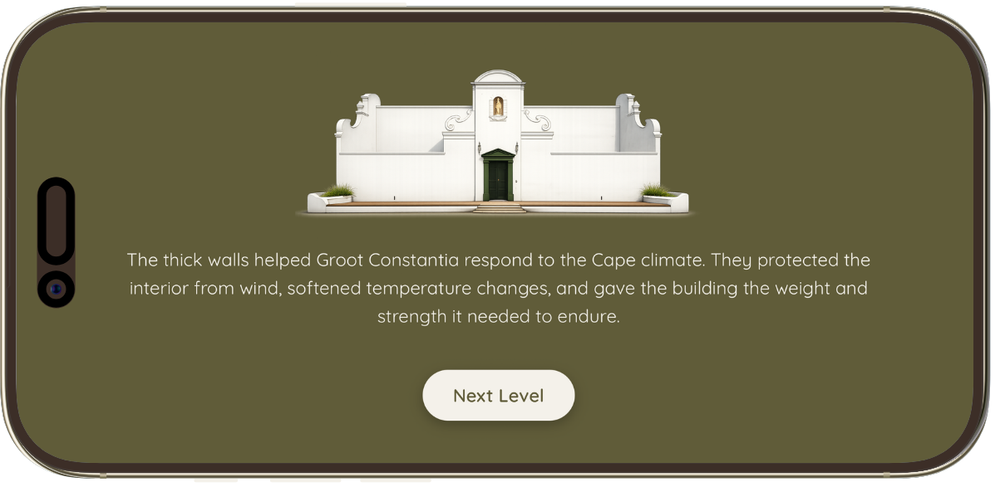

---

## Window Level

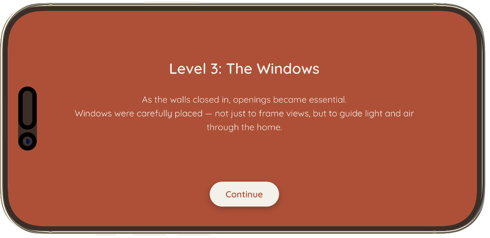
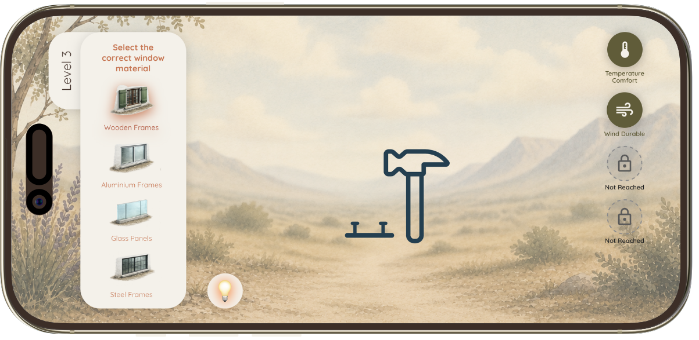
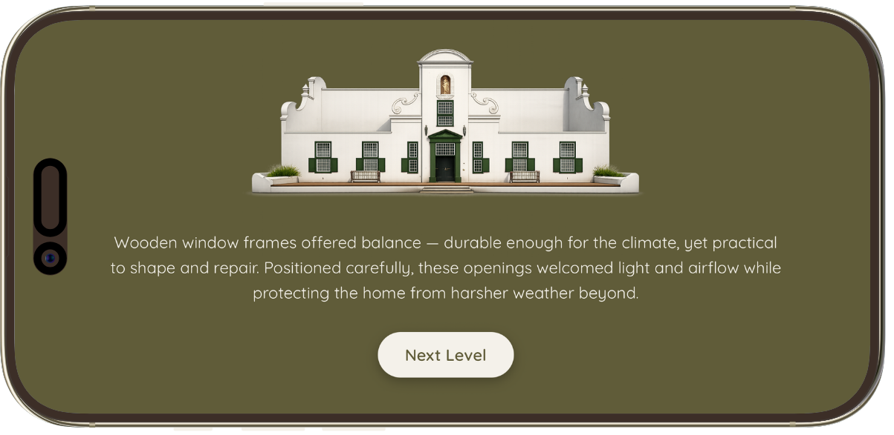

---

## Roof Level

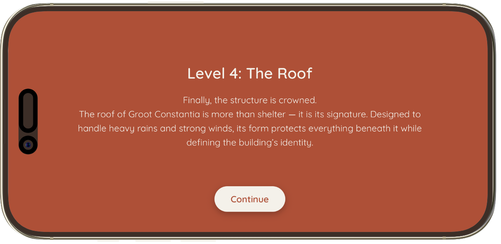
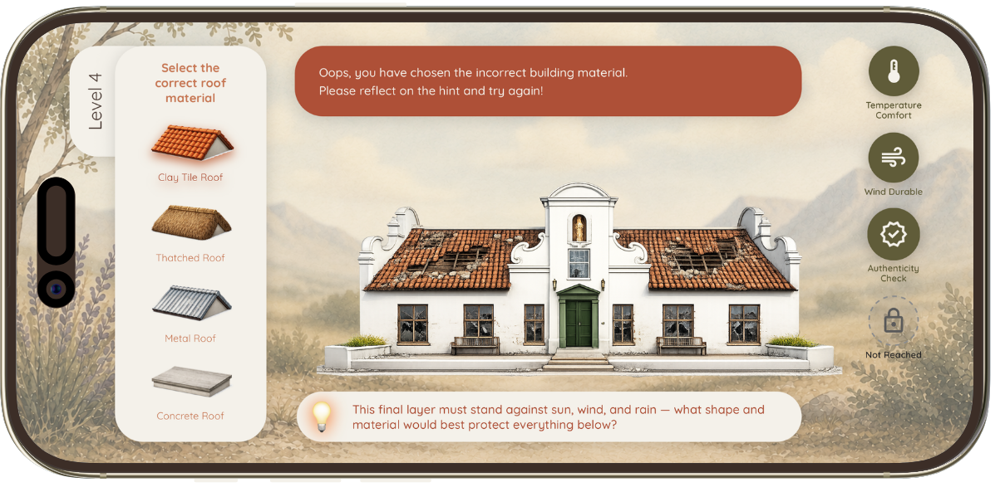
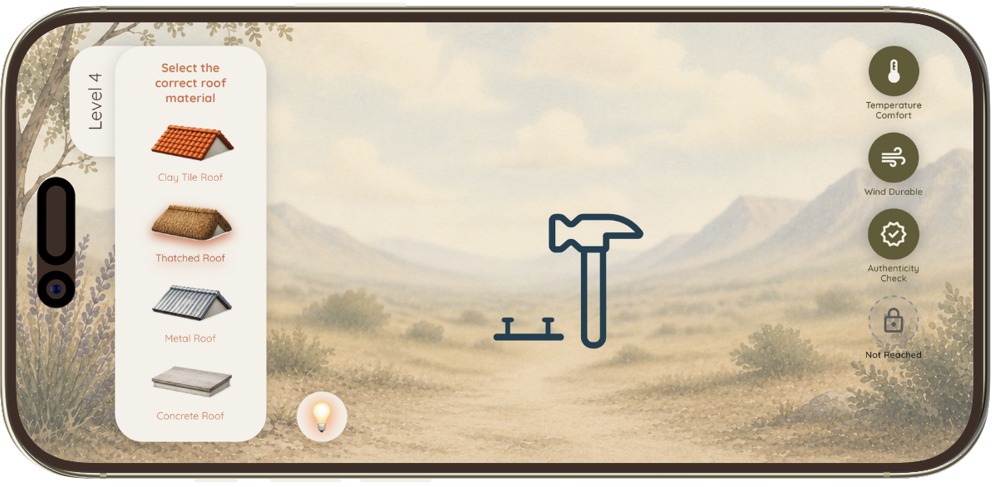
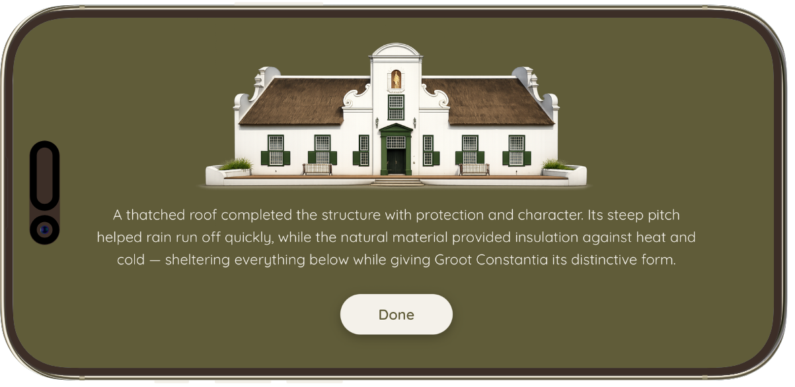

---

## Completed Manor

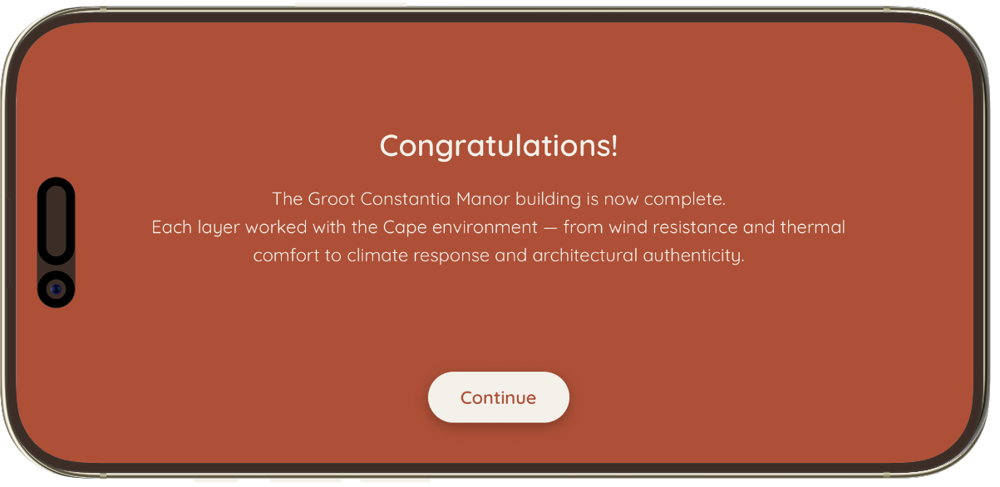
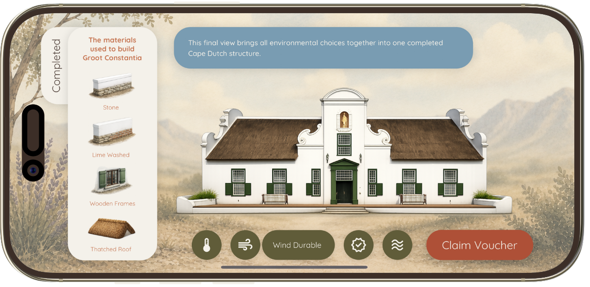
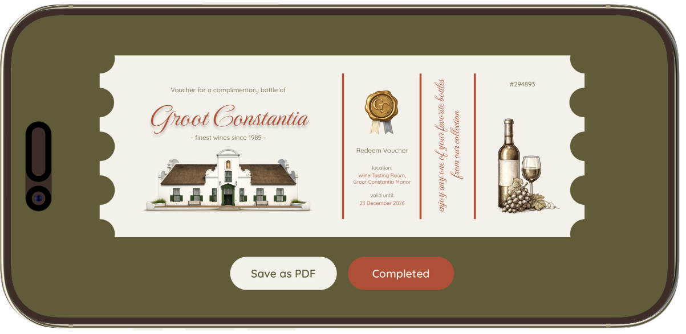

---

# Demonstration Video

A complete walkthrough of Cape Origins can be viewed below:

### Video Link

🔗 **[Insert YouTube or Vimeo Link Here]**

---

# Educational Focus

Cape Origins explores key architectural principles found within Cape Dutch architecture:

- Natural ventilation
- Thermal regulation
- Material durability
- Wind resistance
- Environmental adaptation
- Historical construction techniques

The application demonstrates how architecture can respond intelligently to environmental conditions without modern technology.

---

# Project Structure

```text
CapeOrigins
│
├── assets
│   ├── logo.png
│   ├── cape-origins-title.png
│   ├── images
│   ├── icons
│   └── fonts
│
├── mockups
│   ├── banner.png
│   ├── home-screen.png
│   ├── foundation-screen.png
│   ├── wall-screen.png
│   ├── window-screen.png
│   ├── roof-screen.png
│   └── completed-screen.png
│
├── screens
├── navigation
├── components
├── constants
└── App.tsx
```

---

# Future Development

Potential future enhancements include:

- Additional heritage buildings
- Audio narration
- Achievement systems
- Interactive timelines
- Expanded educational content
- Museum integration
- Accessibility improvements

---

# Reflection

Cape Origins explores how interaction design can be used to preserve and communicate cultural heritage through meaningful digital experiences.

By combining architecture, environmental storytelling, and educational gameplay, the project demonstrates how historical knowledge can be transformed into an engaging and memorable learning experience.

The project encourages users to learn through participation rather than observation, strengthening the connection between heritage education and interactive technology.

---

# Author

## Iné Smith

**Student Number:** 221076

**PP410 Creative Practice – Theme 2 Phase 3 Final Deliverable**

**Postgraduate Diploma (PGD)**

**Open Window Institute**

---

# Acknowledgements

Special thanks to:

- Groot Constantia
- Open Window Institute
- Historical and architectural research sources
- South African heritage preservation initiatives

---

<div align="center">

### "Every wall, window, and roof tells a story."

### Cape Origins allows users to build that story themselves.

</div>

<div>

<div align="center">

</div>